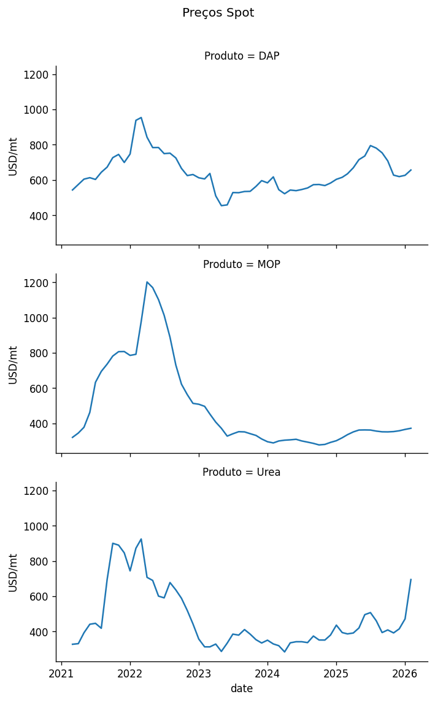
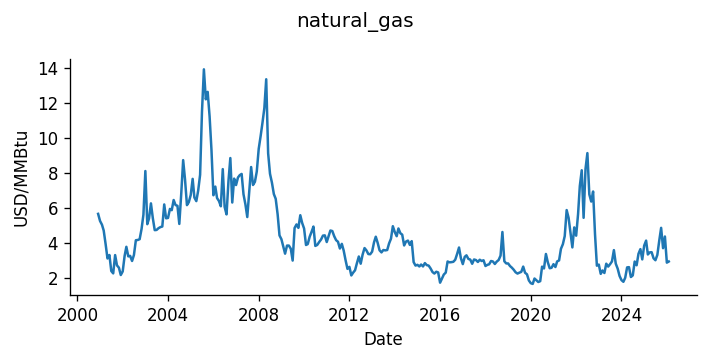
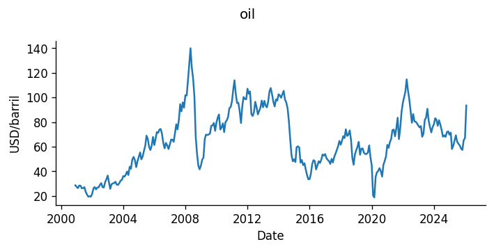
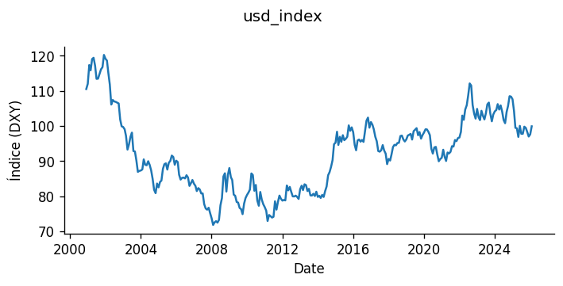
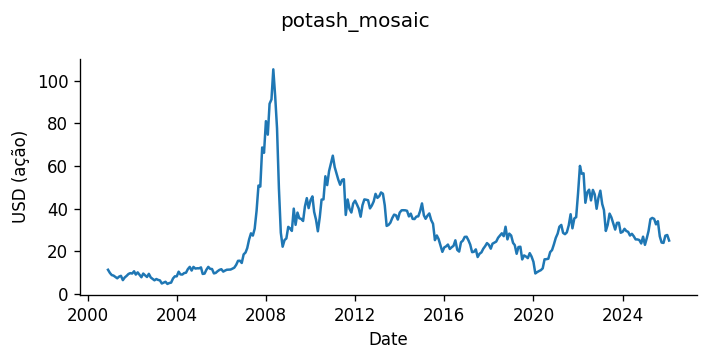
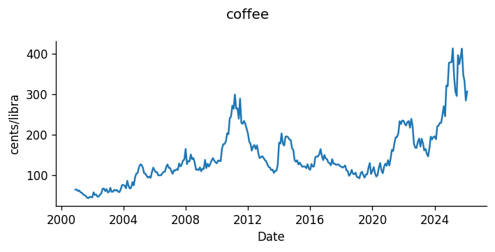
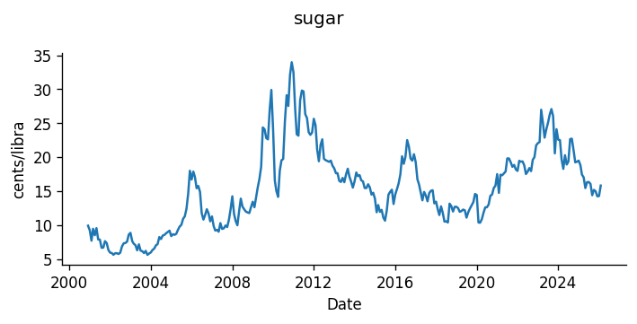
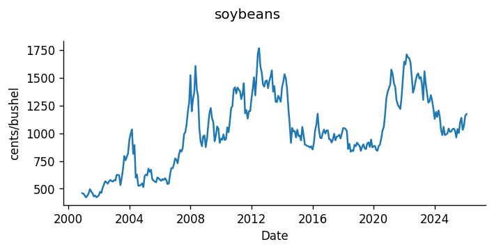
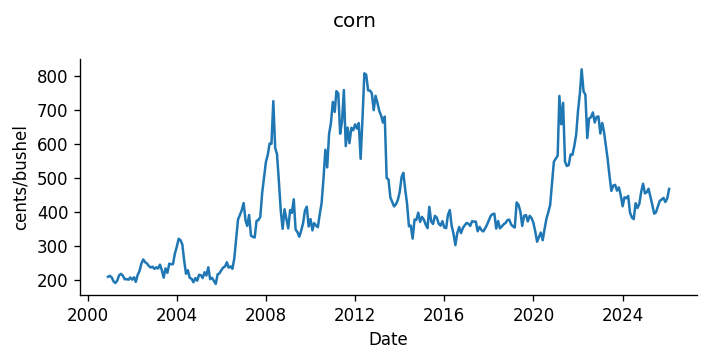

#  QuantImport  
  

**[Home](https://quantimportbrazil.github.io/sobre/)**  
**[Demo](https://quantimportbrazil.github.io/demo/)**  

---  

## Resumo Executivo  

Volatilidade diária: Preços e variáveis macroeconômicas são capturados no momento da emissão, podendo gerar ajustes ao longo do mês.

Bloqueios físicos: O fluxo no Estreito de Hormuz é considerado nulo por prazo indeterminado (mar/26). Além disso, eventos como danos a plantas de fertilizantes mostram que restrições físicas de oferta podem ocorrer independentemente de preços ou indicadores.

Limitações do modelo: Choques físicos extremos — especialmente em produção e logística — podem não ser totalmente capturados pelos dados.

Previsão sob incerteza: Mesmo com menor previsibilidade, decisões precisam ser tomadas. A modelagem não elimina a incerteza, mas a organiza, tornando o risco mais explícito.

“Plans are useless, but planning is indispensable.” — Dwight D. Eisenhower  

---  

### Valores de referência utilizados na emissão das previsões  

Os valores abaixo correspondem a preços de mercado observados na data de execução e foram processados em conjunto com as demais variáveis do modelo para a geração das previsões apresentadas.  

  

  

  

  

  

  

  

  

  

---

## Nota metodológica  

Os valores apresentados correspondem a preços de mercado observados e tratados para fins analíticos. Não constituem previsão pontual de preços, mas sim insumos para a construção de cenários sob hipóteses específicas.  

---